# Graphical User Interface Prototype  

Authors: Concetto Antonino Privitera, Calogero Pisano

Date: 09/04/2020

Version: 1

\<Report here the GUI that you propose. You are free to organize it as you prefer. A suggested presentation matches the Use cases and scenarios defined in the Requirement document. The GUI can be shown as a sequence of graphical files (jpg, png)  >

Interactive UI available here: https://www.figma.com/proto/db124VUncG05TwXo50wxVI/EZGas?node-id=1%3A2&scaling=scale-down


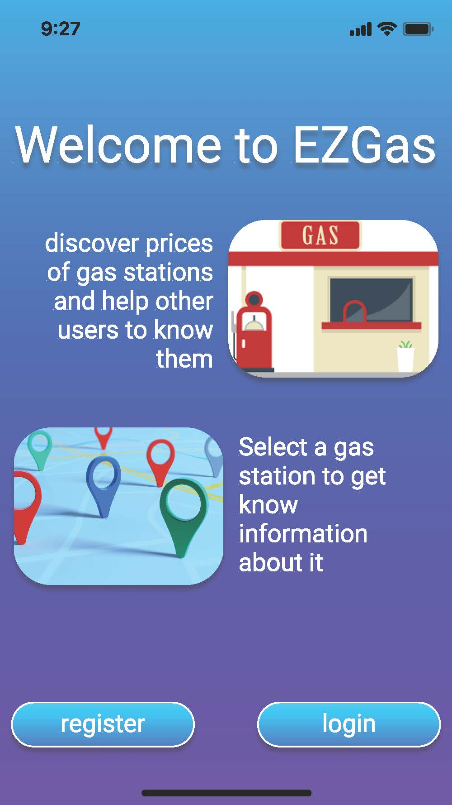
page 1 - welcome

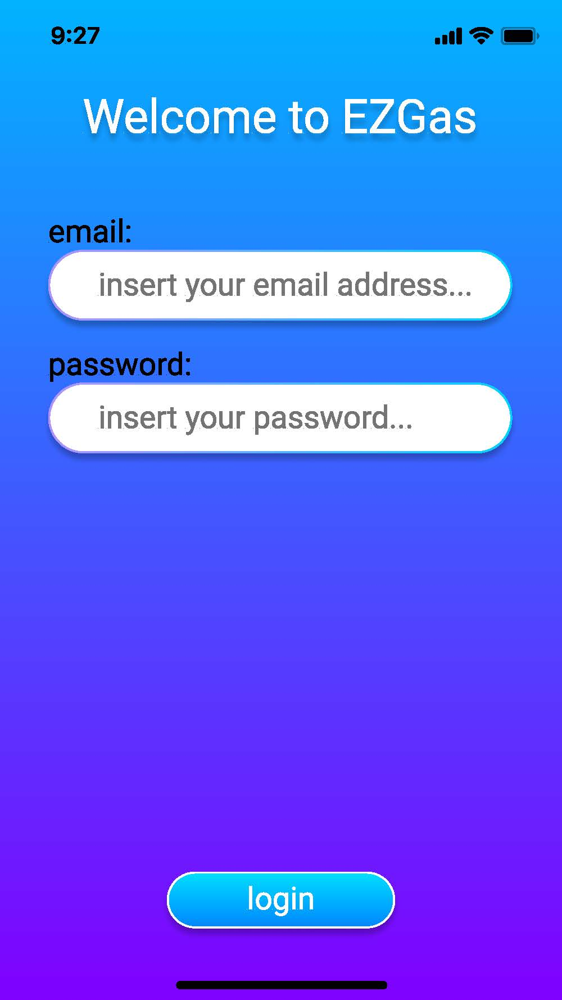 
page 2 - login

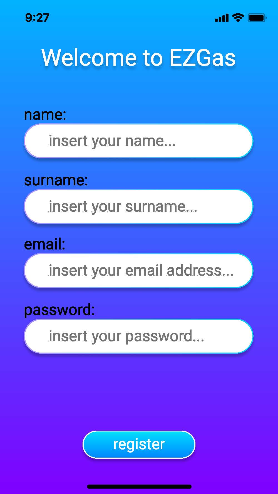 
page 3 - register

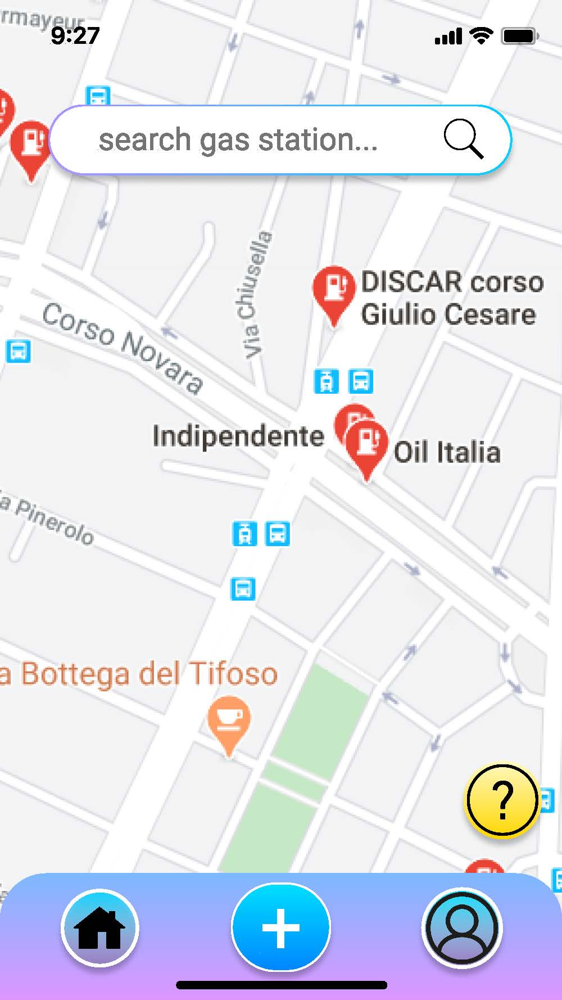 
page 3 - menu

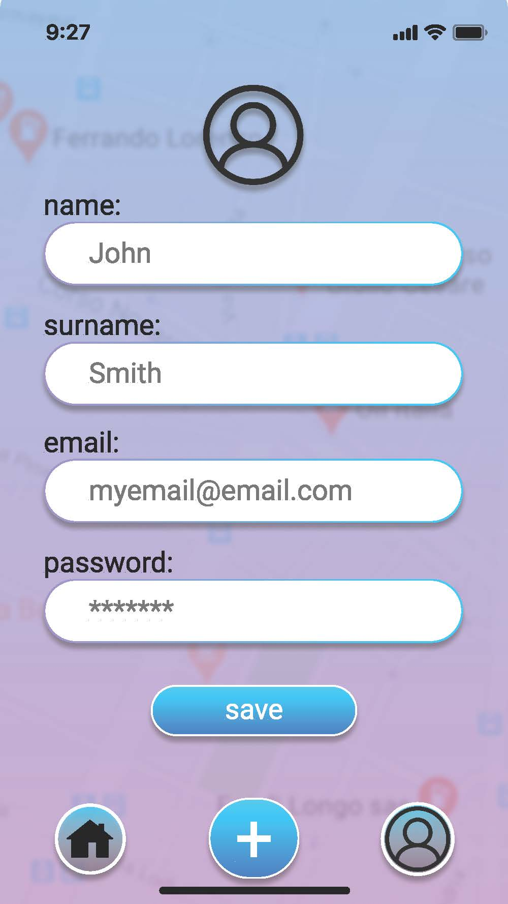 
page 5 - profile

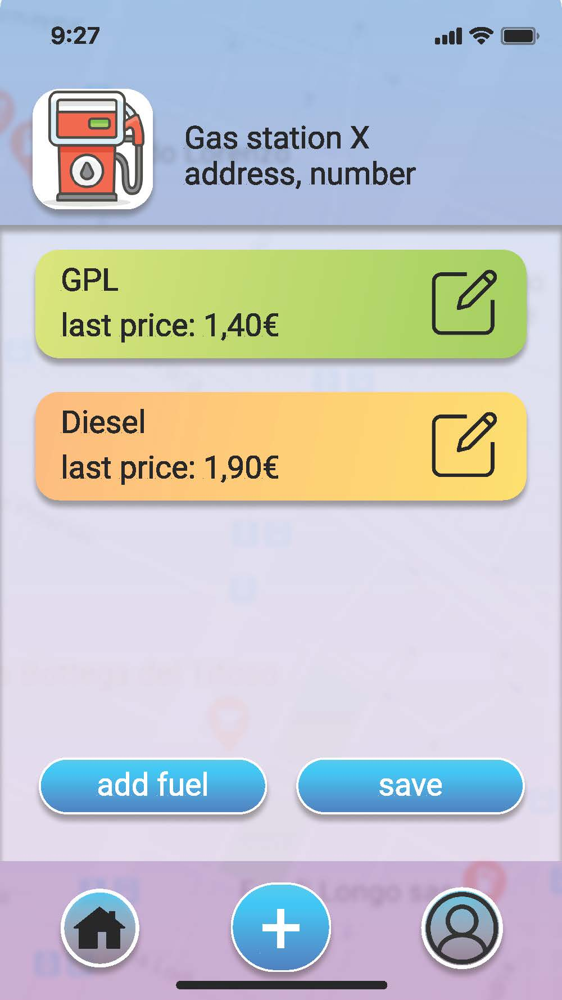 
page 6 - gas station

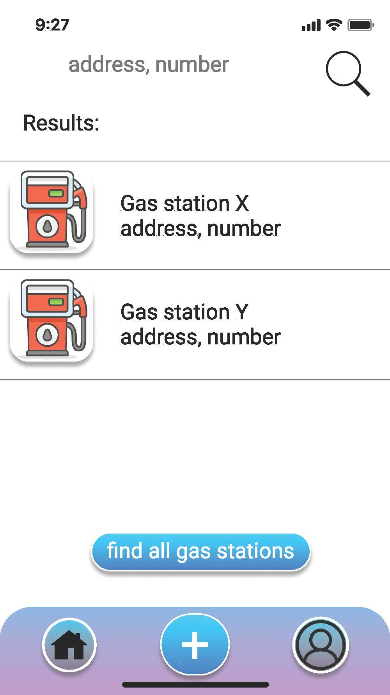 
page 7 - search

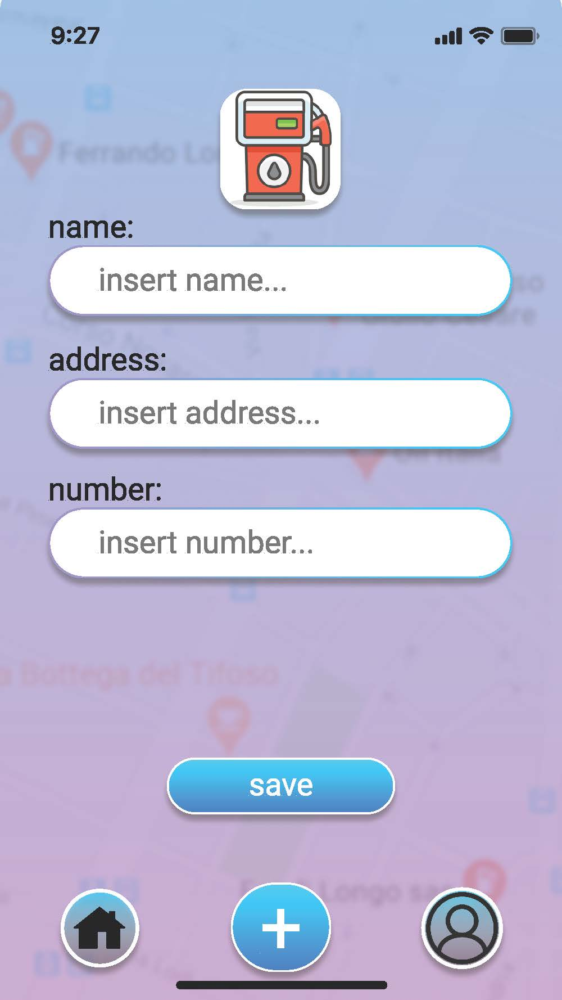 
page 8 - new gas station

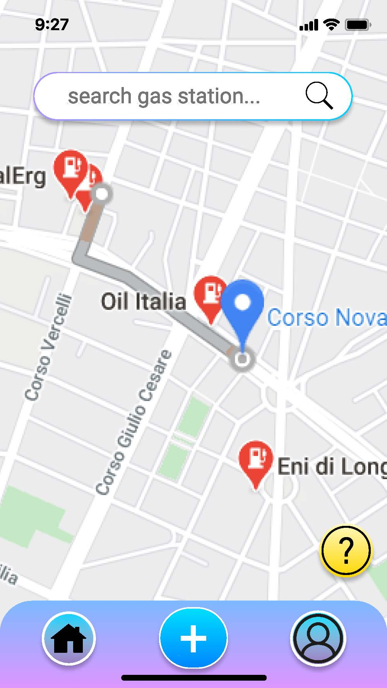 
page 9 - path

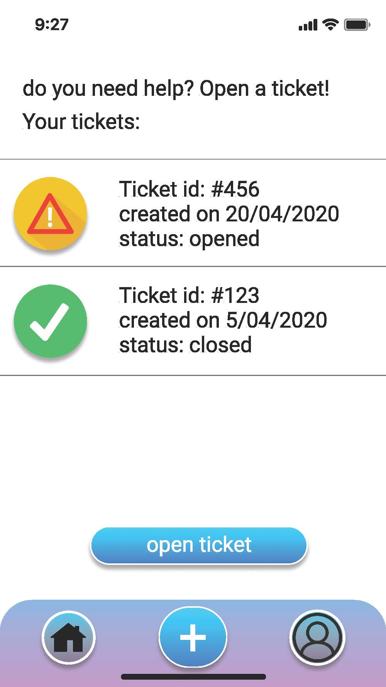 
page 10 - help

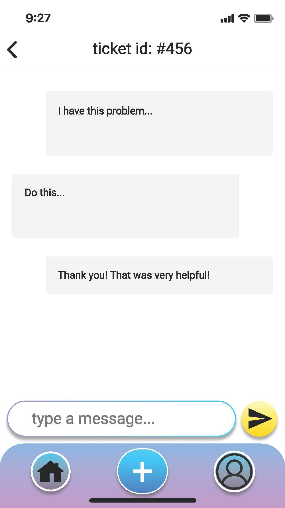 
page 11 - ticket

links UI:
```plantuml
collections welcome as w
collections login as l
collections register as r
collections menu as m
collections profile as p
collections gas_station as gs
collections search as s
collections new_gas_station as ngs
collections path as pa
collections help as h
collections ticket as t
w -> l : click login button
w -> r : click register button
l -> m : click login button
r -> m : click register button
m -> gs : click on a gas station on the map
m -> p : click profile button
m -> ngs : click + button
m -> s : add address on seach box
m -> h : click on question mark button
p -> m : click home button
p -> ngs : click + button
gs -> ngs : click + button
gs -> m : click home button
gs -> p : click profile button
ngs -> m : click home button
ngs -> p : click profile button
s -> ngs : click + button
s -> m : click home button
s -> p : click profile button
s -> gs : select a gas station in the list
s -> pa : click on find all gas station button
pa -> ngs : click + button
pa -> p : click profile button
pa -> m : click home button
pa -> s : add address on seach box
pa -> h : click on question mark button
h -> p : click profile button
h -> m : click home button
h -> ngs : click + button
h -> t : click on a ticket in the list
h -> t : click on open ticket button
t -> p : click profile button
t -> m : click home button
t -> ngs : click + button
t -> h : click on back button

```